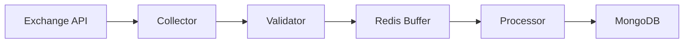
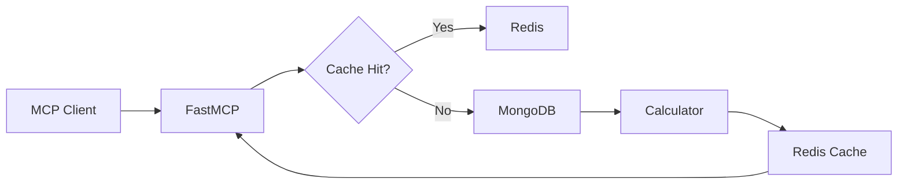

# 📊 Arquitectura Cloud MarketData

## Visión General

Cloud MarketData es un microservicio diseñado para recopilar, procesar y servir datos de mercado en tiempo real con alta confiabilidad y eficiencia.

## Componentes Principales

### 1. Collectors Layer
```
WebSocket Streams (Bybit/Binance)
         ↓
    BaseCollector
    ├── BybitCollector
    │   ├── TradesCollector
    │   └── OrderbookCollector
    └── BinanceCollector
        ├── TradesCollector
        └── OrderbookCollector
```

**Responsabilidades:**
- Mantener conexiones WebSocket estables
- Reconnection automática con backoff
- Normalización de datos entre exchanges
- Circuit breaker para fallos

### 2. Processing Layer
```
Raw Data → Redis Queue → Processors → Aggregated Data
                ↓
         ┌─────────────┐
         │  Volume     │
         │  Profile    │
         │  Calculator │
         └─────────────┘
                ↓
         ┌─────────────┐
         │  Order Flow │
         │  Analyzer   │
         └─────────────┘
```

**Responsabilidades:**
- Cálculo incremental de Volume Profile
- Análisis de Order Flow (delta, absorción)
- Agregación por timeframes
- Detección de anomalías

### 3. Storage Layer
```
┌─────────────┐     ┌─────────────┐     ┌─────────────┐
│    Redis    │     │   MongoDB   │     │   S3/Minio  │
│  (Hot Data) │ --> │ (Warm Data) │ --> │ (Cold Data) │
└─────────────┘     └─────────────┘     └─────────────┘
     0-1h              1h-7d              7d+
```

**Estrategia de Retención:**
- **Hot (Redis)**: Datos raw últimos 60 minutos
- **Warm (MongoDB)**: Agregados 1m (24h), 1h (7d)
- **Cold (S3)**: Perfiles diarios > 7 días

### 4. API Layer
```
┌─────────────────────────┐
│      FastAPI Server     │
├─────────────────────────┤
│      FastMCP Server     │
├─────────────────────────┤
│   REST │ WebSocket │MCP │
└─────────────────────────┘
```

**Endpoints MCP:**
- `get_volume_profile`: Perfil de volumen por rango
- `get_order_flow`: Métricas de flujo de órdenes
- `get_market_depth`: Profundidad actual del mercado
- `stream_trades`: Stream de trades en tiempo real

## Flujos de Datos

### Flujo de Ingesta


### Flujo de Consulta


## Patrones de Diseño

### 1. Repository Pattern
```python
class TradeRepository:
    async def save(trade: Trade) -> None
    async def find_by_range(start: datetime, end: datetime) -> List[Trade]
    async def aggregate_by_price(symbol: str, interval: str) -> VolumeProfile
```

### 2. Circuit Breaker
```python
class CircuitBreaker:
    def __init__(self, failure_threshold=5, recovery_timeout=60):
        self.failures = 0
        self.last_failure_time = None
        self.state = "CLOSED"  # CLOSED, OPEN, HALF_OPEN
```

### 3. Event Sourcing
```python
@dataclass
class TradeEvent:
    timestamp: datetime
    symbol: str
    price: Decimal
    volume: Decimal
    side: str
    exchange: str
```

## Escalabilidad

### Horizontal
- Múltiples instancias de collectors por exchange
- Sharding de MongoDB por símbolo
- Redis Cluster para alta disponibilidad

### Vertical
- Optimización de algoritmos O(n) → O(log n)
- Caching agresivo de cálculos costosos
- Índices compuestos en MongoDB

## Monitoreo

### Métricas Clave
- **Latencia de ingesta**: p50, p95, p99
- **Trades por segundo**: Por exchange y símbolo
- **Uso de recursos**: CPU, RAM, Disk I/O
- **Errores**: Rate, tipos, recovery time

### Health Checks
```python
GET /health
{
    "status": "healthy",
    "collectors": {
        "bybit": "connected",
        "binance": "connected"
    },
    "storage": {
        "redis": "ok",
        "mongodb": "ok"
    },
    "uptime": "72h 15m 32s"
}
```

### Docker Commands
```bash
# Verificar salud del sistema
docker-compose ps
curl http://localhost:8000/health

# Monitoreo en tiempo real
docker stats $(docker-compose ps -q)
docker-compose logs -f

# Debugging específico
docker-compose exec app python -c "from src.core.config import Settings; print(Settings())"
```

## Seguridad

- **API Keys**: Rotación automática cada 30 días
- **Rate Limiting**: Por IP y por API key
- **Encryption**: TLS 1.3 para todas las conexiones
- **Audit Logs**: Todas las operaciones registradas

---

*Para más detalles de implementación, ver `/claude/docs/`*
*Comandos Docker: Ver `DOCKER_COMMANDS.md` y `claude/docs/docker-commands-guide.md`*
