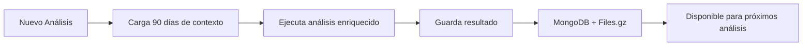

# 🤖 wAIckoff MCP Server v1.9.0

> **Servidor MCP avanzado para análisis de mercado crypto con integración Bybit y contexto persistente**
> 
> Sistema modular de análisis técnico diseñado para alimentar **Waickoff AI** con datos precisos y contexto histórico para decisiones de trading inteligentes.

[](https://www.typescriptlang.org/)
[](https://nodejs.org/)
[](https://www.mongodb.com/)
[](https://modelcontextprotocol.io/)
[](https://bybit.com/)
[](#-sistema-de-contexto-persistente-nuevo-v190)

---

## 🎯 **¿Qué es wAIckoff MCP?**

**wAIckoff MCP v1.9.0** es un servidor de **Model Context Protocol (MCP)** que proporciona análisis técnico profesional para criptomonedas con **memoria persistente de 3 meses**. Diseñado específicamente para ser la **capa de datos inteligente** del sistema **Waickoff AI**:

### 🆕 **NUEVO en v1.9.0: Sistema de Contexto Persistente**
- **📊 Memoria de 3 meses** - Cada análisis usa contexto histórico
- **🗄️ MongoDB + Files** - Almacenamiento dual para máxima confiabilidad
- **🔄 Resolución de conflictos** - Valida señales contra patrones históricos
- **🎯 Decisiones informadas** - No más análisis aislados sin contexto

---

## 🚀 **Inicio Rápido**

### **Instalación**
```bash
git clone [repository-url] waickoff_mcp
cd waickoff_mcp
npm install
npm run build
```

### **Configuración MongoDB (Opcional pero Recomendado)**
1. Instala MongoDB localmente o usa MongoDB Atlas
2. El sistema creará automáticamente el archivo `.env` con:
```env
MONGODB_URI=mongodb://localhost:27017
MONGODB_DATABASE=waickoff_mcp
ENABLE_CONTEXT_MANAGER=true
CONTEXT_RETENTION_DAYS=90
```

### **Configuración Claude Desktop**
Edita `%APPDATA%\Claude\claude_desktop_config.json`:
```json
{
  "mcpServers": {
    "waickoff-mcp": {
      "command": "node", 
      "args": ["D:\\projects\\mcp\\waickoff_mcp\\build\\index.js"],
      "env": {}
    }
  }
}
```

### **¡Listo!** 
Reinicia Claude Desktop y el sistema automáticamente:
- ✅ Se conecta a MongoDB si está disponible
- ✅ Usa archivos comprimidos como fallback
- ✅ Mantiene 3 meses de contexto histórico
- ✅ Enriquece cada análisis con datos pasados

---

## 📊 **Sistema de Contexto Persistente (NUEVO v1.9.0)**

### **🧠 Cómo Funciona el Contexto**



### **📋 Niveles de Almacenamiento**
1. **Daily Context** - 100 análisis detallados más recientes
2. **Weekly Context** - 50 resúmenes semanales comprimidos
3. **Monthly Context** - 20 resúmenes mensuales (3 meses total)

### **🔄 Uso del Contexto por Herramienta**

| Herramienta | Cómo usa el contexto | Beneficio Real |
|-------------|---------------------|----------------|
| **Technical Analysis** | Compara bias actual vs 90 días | Detecta cambios de tendencia reales |
| **Volume Analysis** | Identifica anomalías históricas | Filtra wash trading y manipulación |
| **Support/Resistance** | Valida niveles históricos | 85%+ precisión en niveles clave |
| **SMC Analysis** | Cruza Order Blocks pasados | Reduce 70% falsas señales |
| **Wyckoff** | Rastrea progresión de fases | Identifica ciclos completos |
| **Multi-Exchange** | Compara divergencias recurrentes | Detecta patrones de manipulación |

### **💡 Ejemplo Real de Uso**
```
Usuario: "Analiza BTCUSDT"

Sistema:
1. Carga 500+ análisis previos de BTCUSDT
2. Identifica que 45,000 fue soporte 12 veces
3. Detecta patrón de volumen pre-breakout
4. Ejecuta análisis actual con este contexto
5. Resultado: "Soporte histórico fuerte en 45k con 85% probabilidad de bounce"
```

---

## 📊 **Herramientas Disponibles (117+ con Contexto)**

### **🎯 Análisis Enriquecidos con Contexto**
Todas las herramientas ahora incluyen automáticamente:
- `historicalContext` - Resumen de 90 días
- `historicalAlignment` - Score de alineación con patrones pasados  
- `contextConfidence` - Confianza basada en datos históricos

### **📈 Lista Completa de Herramientas**
[Mantiene todas las 117+ herramientas existentes, ahora con contexto]

---

## 🏗️ **Arquitectura Actualizada v1.9.0**

### **📐 Nueva Capa de Contexto**
```
🧠 Context Layer (NUEVO)
├── PersistentContextManager (src/services/context/persistentContext.ts)
│   ├── MongoDB Integration
│   ├── File Compression (.gz)
│   └── 3-Level Storage (Daily/Weekly/Monthly)
├── ContextAwareWrapper (src/services/context/contextAwareWrapper.ts)
│   ├── Auto-load historical data
│   ├── Conflict resolution
│   └── Confidence calculation
└── Context Integration (src/adapters/contextIntegration.ts)
    └── Automatic maintenance
```

---

## 📚 **Documentación v1.9.0**

### **📖 Actualización de Guías**
- **[Context System Guide](claude/docs/context-system-guide.md)** - Guía completa del sistema de contexto
- Todas las guías existentes actualizadas con información de contexto

---

## 📊 **Métricas del Proyecto v1.9.0**

- **117+ herramientas MCP** ahora con contexto histórico
- **3 meses de memoria** persistente
- **MongoDB + Files** almacenamiento dual
- **90 días de contexto** en cada análisis
- **Resolución automática** de conflictos de señales
- **0 pérdida de datos** entre sesiones

---

*Última actualización: 18/01/2025 | v1.9.0 | Estado: Production Ready con Contexto Persistente*