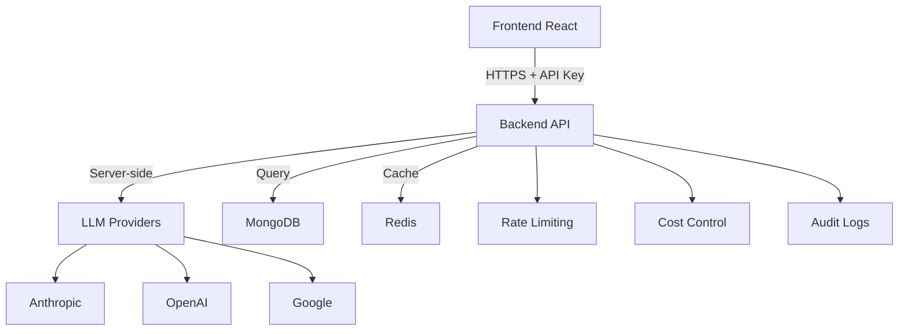

¡Excelente punto Carlos! Tienes razón, hay un problema de **seguridad crítico** y **arquitectura incorrecta**. Vamos a analizarlo:
Search files...
Ran tool
¡CRÍTICO! 🚨 Has identificado un **problema de seguridad MASIVO**. Voy a crear la documentación de la nueva arquitectura segura:
Ahora voy a actualizar la trazabilidad:
¡Perfecto Carlos! 🚨 Has identificado un **problema de seguridad CRÍTICO**. Te explico la situación:

## 🚨 **RESPUESTA A TU PREGUNTA**

### **❌ PROBLEMA ACTUAL**:
- **LLM requests desde frontend** - API keys expuestas al cliente
- **`dangerouslyAllowBrowser: true`** - Configuración insegura
- **Variables VITE_** con secrets - Visibles en bundle
- **Sin rate limiting** - Costos descontrolados
- **MCP Server inexistente** - Frontend intenta conectar a servidor eliminado

### **✅ ARQUITECTURA CORRECTA**:
- **LLM solo en backend** - API keys seguras en servidor
- **Frontend → API → LLM** - Flujo seguro
- **Rate limiting por usuario** - Control de costos
- **Auditoría completa** - Logs de uso
- **Chatbot page** - Después de API segura

## 📊 **ESTADO ACTUAL vs CORRECTO**

### **❌ Estado Actual (Inseguro)**:
```typescript
// Frontend hace requests directos a LLM APIs
const anthropic = new Anthropic({
  apiKey: process.env.VITE_ANTHROPIC_API_KEY, // ← EXPUESTO
  dangerouslyAllowBrowser: true // ← PELIGROSO
});
```

### **✅ Estado Correcto (Seguro)**:
```typescript
// Frontend solo llama a nuestro backend
const response = await api.post('/api/v1/chat/analyze', {
  message: "Analyze BTCUSDT",
  symbol: "BTCUSDT"
  // No API keys, no secrets
});
```

## 🎯 **PLAN CORRECTO**

### **🚨 PRIORIDAD 1: TASK-105** (4 días)
1. **Migrar LLM al backend** - Seguridad crítica
2. **Remover API keys del frontend** - Eliminar vulnerabilidades
3. **Implementar rate limiting** - Control de costos
4. **Crear endpoints seguros** - /chat/analyze, /chat/stream

### **🔄 PRIORIDAD 2: TASK-104** (6 días)
- Data Bootstrap + Smart Caching
- Foundational para todos los indicadores

### **⏳ PRIORIDAD 3: TASK-103** 
- Indicadores nativos Wyckoff + SMC
- Después de tener API completa y segura

## 🏗️ **ARQUITECTURA FINAL**



## ✅ **TU ENFOQUE ES CORRECTO**

1. **Seguridad primero** - Sin API keys expuestas
2. **Backend centralizado** - Control total
3. **API completa** - Datos + indicadores + LLM
4. **Escalable** - Rate limiting, monitoring
5. **Chatbot después** - Una vez API sea segura

### **Secuencia Correcta**:
1. 🚨 **TASK-105** - LLM Security (URGENTE)
2. 🔄 **TASK-104** - Data Bootstrap (Foundational)  
3. ⚡ **TASK-103** - Indicadores nativos
4. 🎯 **Chatbot UI** - Interfaz final

**Conclusión**: Has identificado correctamente que el LLM actual es **inseguro** y debe migrarse al backend. La **TASK-105 es crítica** y debe hacerse antes que cualquier otra cosa. 🚨