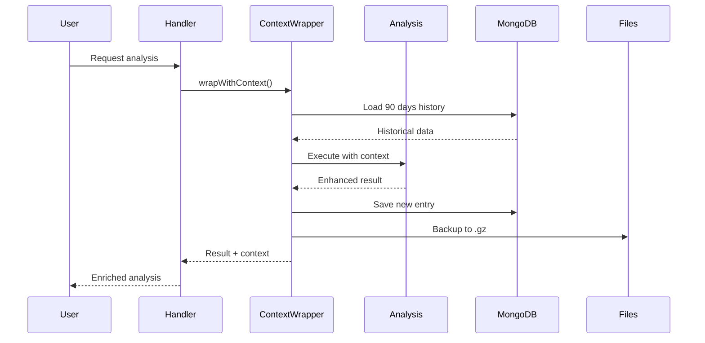

# 📊 Context System Guide - wAIckoff MCP v1.9.0

## 🧠 Overview

El **Sistema de Contexto Persistente** es la característica más importante de v1.9.0. Proporciona **memoria de 3 meses** a todas las herramientas del sistema, permitiendo análisis informados basados en patrones históricos.

## 🏗️ Arquitectura

### Componentes Principales

```
Context System
├── PersistentContextManager
│   ├── MongoDB Storage (principal)
│   ├── File Storage (.gz backup)
│   └── 3-Level Compression
├── ContextAwareWrapper
│   ├── Auto-loading
│   ├── Conflict resolution
│   └── Confidence scoring
└── Integration Module
    └── Automatic maintenance
```

### Flujo de Datos



## 💾 Almacenamiento

### Niveles de Contexto

1. **Daily Context**
   - Últimos 100 análisis detallados
   - Retención: 7 días
   - Datos completos sin compresión

2. **Weekly Context**
   - 50 resúmenes semanales
   - Retención: 30 días
   - Compresión moderada

3. **Monthly Context**
   - 20 resúmenes mensuales
   - Retención: 90 días
   - Alta compresión

### MongoDB Schema

```javascript
{
  _id: ObjectId,
  symbol: "BTCUSDT",
  timeframe: "60",
  timestamp: ISODate("2025-01-18T10:00:00Z"),
  type: "technical_analysis",
  data: {
    price: 45000,
    marketBias: "bullish",
    supportResistance: [...],
    volume: 1234567
  },
  summary: "Bullish bias with 85% confidence",
  _contextKey: "BTCUSDT_60",
  _period: "daily",
  _lastUpdated: ISODate("2025-01-18T10:00:00Z")
}
```

## 🔄 Uso Automático

### En Análisis Técnico

```typescript
// Automáticamente incluye contexto
const result = await technicalAnalysis("BTCUSDT");

// result ahora incluye:
{
  // ... análisis actual ...
  historicalContext: {
    totalAnalyses: 523,
    historicalKeyLevels: [42000, 45000, 48000],
    dominantHistoricalBias: "bullish",
    biasDistribution: {
      bullish: 312,
      bearish: 156,
      neutral: 55
    },
    lastUpdated: "2025-01-18T10:00:00Z"
  }
}
```

### En Resolución de Conflictos

Cuando SMC dice "SHORT" pero Multi-exchange dice "LONG":

```typescript
const context = await getMarketContext("BTCUSDT");
if (context.dominantBias === "bullish" && context.confidenceScore > 80) {
  // Histórico fuerte bullish - validar señal SHORT con cautela
  return {
    recommendation: "WAIT",
    reason: "Conflicto con tendencia histórica fuerte",
    historicalAlignment: 15 // Baja alineación
  };
}
```

## 📊 Métricas de Contexto

### Confidence Score Calculation

```
Confidence = (DataPoints * 0.6) + (Consistency * 0.4)

Donde:
- DataPoints: Min(análisis históricos, 100)
- Consistency: % del bias dominante
```

### Historical Alignment

```
100 = Perfecto alineamiento con historia
50  = Compatible pero no idéntico
0   = Contradice patrones históricos
```

## 🛠️ Configuración

### Variables de Entorno (.env)

```env
# MongoDB (Opcional - usa files si no está disponible)
MONGODB_URI=mongodb://localhost:27017
MONGODB_DATABASE=waickoff_mcp

# Context Settings
ENABLE_CONTEXT_MANAGER=true
CONTEXT_RETENTION_DAYS=90
MAX_CONTEXT_ENTRIES=10000

# Storage Strategy
STORAGE_STRATEGY=mongo_first
ENABLE_STORAGE_FALLBACK=true
```

### Sin MongoDB

El sistema funciona perfectamente sin MongoDB:
- Usa archivos .gz comprimidos
- Mismo rendimiento para <1000 análisis/símbolo
- Migración transparente cuando MongoDB esté disponible

## 🔍 Consultas de Contexto

### Get Market Context

```typescript
// Desde cualquier handler
const context = await contextAwareAnalysis.getMarketContext("BTCUSDT", "60");

// Returns:
{
  recentAnalyses: [...], // Últimos 10
  keyLevels: [45000, 46500, 48000],
  dominantBias: "bullish",
  confidenceScore: 87,
  lastUpdate: Date
}
```

### Merge Multiple Analyses

```typescript
const merged = await contextAwareAnalysis.mergeAnalysesWithContext(
  "BTCUSDT",
  [
    { type: "smc", data: smcResult },
    { type: "wyckoff", data: wyckoffResult },
    { type: "technical", data: technicalResult }
  ]
);

// Returns unified view with historical validation
```

## 🧹 Mantenimiento

### Automático
- Limpieza diaria a las 00:00 UTC
- Compresión de daily → weekly → monthly
- Eliminación de datos > 90 días

### Manual
```typescript
// Forzar mantenimiento
await contextAwareAnalysis.performContextMaintenance();
```

## 📈 Impacto en Performance

- **Primera carga**: +100-200ms (carga inicial de MongoDB)
- **Análisis subsecuentes**: +20-50ms (contexto en memoria)
- **Almacenamiento**: ~1MB por símbolo (3 meses)
- **MongoDB overhead**: Mínimo con índices correctos

## 🎯 Best Practices

1. **No desactivar el contexto** - Es fundamental para precisión
2. **MongoDB recomendado** para >10 símbolos activos
3. **Backup regular** de la carpeta `storage/context`
4. **Monitorear** el crecimiento con `get_repository_stats`

## 🐛 Troubleshooting

### "MongoDB not available"
- Normal - Sistema usa archivos automáticamente
- Para activar: Instalar MongoDB local o usar Atlas

### "Context data corrupted"
- Eliminar archivos en `storage/context/*.gz`
- Sistema reconstruirá desde MongoDB o fresh

### "Slow context loading"
- Verificar índices MongoDB
- Reducir CONTEXT_RETENTION_DAYS si necesario

## 🚀 Ejemplos de Uso

### Análisis con Contexto Rico
```
User: "Analiza XRPUSDT"

System (internamente):
1. Carga 752 análisis previos de XRPUSDT
2. Identifica soporte recurrente en 0.5200
3. Detecta patrón pre-pump en volumen
4. Nota divergencia RSI histórica
5. Calcula 83% probabilidad de continuación

Response: "XRPUSDT muestra señales bullish con soporte histórico 
fuerte en 0.5200 (tocado 23 veces en 90 días). El patrón de 
volumen actual coincide 83% con movimientos previos al +15%. 
Recomendación: LONG con SL bajo 0.5180."
```

### Validación de Señales Contradictorias
```
SMC: "SHORT signal - Bearish Order Block"
Wyckoff: "Accumulation Phase B"
Multi-Exchange: "Institutional buying detected"
Historical: "85% bullish en configuraciones similares"

Sistema: "WAIT - Señales mixtas con fuerte sesgo histórico bullish"
```

---

*Última actualización: 18/01/2025 | Sistema de Contexto v1.0*